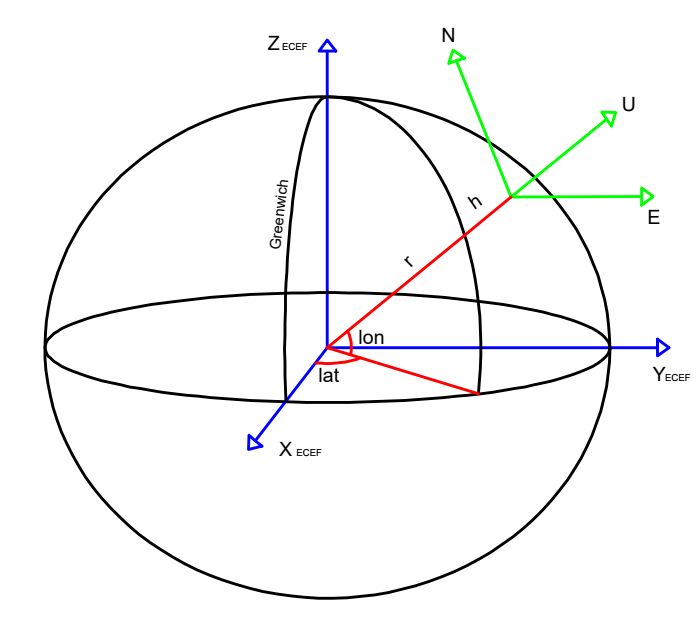

# trajectory-coordinate-converter


## Descrição
O `trajectory-coordinate-converter` é uma aplicação web multiplataforma desenvolvida com Streamlit que permite a conversão de coordenadas espaciais a partir de arquivos CSV ou manualmente. A aplicação utiliza as bibliotecas `pandas`, `numpy`, `pymap3d`, `plotly`  e `Folium` para realizar as conversões necessárias e mostrar dados em um mapa. O ellipsoid WGS84 é utilizado como padrão.

## Funcionalidades
A aplicação possui as páginas principais:
1. **Main**: Página de apresentação e cadastro de ponto de referência sensor.
2. **Conversão entre Grau DMS e Decimal**: Converte coordenadas de graus(degree), minutos e segundos (DMS) para graus decimais ou o contrário.
3. **Conversão de Coordenadas Geodésicas para ECEF e ENU Plano Local**: Converte coordenadas geodésicas para ECEF (Earth-Centered, Earth-Fixed), para ENU (East-North-Up) plano local e azimute, elevação e distância.
4. **Conversão de Coordenadas Plano Local ENU (XYZ) ou Azimute, Elevação e Distância em ECEF e Geodésicas**: Converte coordenadas de plano local ENU (XYZ) ou azimute, elevação e distância para ECEF e coordenadas geodésicas (latitude, longitude e altitude).
5. **Conversão de Coordenadas Plano Local de referência ENU para outro plano local ENU**: Converte coordenadas de plano local ENU (XYZ) ou azimute, elevação e distância para outro plano local ENU (XYZ) e azimute, elevação e distância, e também para ECEF e coordenadas geodésicas .
6. **Conversão de Coordenadas Geocentricas X,Y,Z para plano local ENU**: Converte coordenadas geocêntricas cartesianas (XYZ) para plano local ENU (XYZ) e azimute, elevação e distância, e também para geodésicas .
7. **Velocidade e Aceleração de Trajetória ENU**:  Realiza cálculos de velocidade e aceleração no sistema ENU no referencial do sensor, a partir de trajetórias nominais cartesianas sem ruído em referenciais locais ENU do ponto de partida do veículo.

## Imagem dos sistemas de referência envolvidos


## Pré-requisitos  

### Windows  
1. Instale o Python (>= 3.8) através do [site oficial do Python](https://www.python.org/).  
2. Certifique-se de que o **pip** está instalado. Você pode verificar usando:  
   ```bash  
   python -m ensurepip  
   python -m pip install --upgrade pip  
   ```  

### Linux (Debian/Ubuntu)  
1. Atualize os pacotes do sistema e instale o Python caso não tenha instalado:  
   ```bash  
   sudo apt update && sudo apt upgrade -y  
   sudo apt install python3 python3-pip -y  
   ```  

---

## Instalação  

1. Clone este repositório:  
   
```bash  
   git clone https://github.com/francisvalguedes/trajectory-coordinate-converter.git  
   cd trajectory-coordinate-converter  
```  

2. Crie e ative um ambiente virtual:  
   - No Windows:  
     
```bash  
     python -m venv env  
     env\Scripts\activate
     pip install --upgrade pip
```  
   - No Linux:  
```bash  
     pip install virtualenv
     virtualenv env     
     source env/bin/activate 
     pip install --upgrade pip
```  


3. Instale as dependências do projeto:  

```bash  
   pip install -r requirements.txt  
```  

Alternativamente no Debian/Ubuntu pode instalar com o script de instalaçã

```bash 
    ./install_debian.sh
```

---

## Execução  

1. Navegue até o diretório do projeto (se ainda não estiver).  
2. Execute o aplicativo:  
   
```bash  
   streamlit run source/main.py  
```  
3. Abra o navegador no endereço fornecido pelo terminal (geralmente `http://localhost:8501`).  

4. Em caso de instalação em servidor linux opcionalmente pode ser agendada a inicialização do Crontab com a execução do arquivo run.sh que cria também um log de eventos do aplicativo:
```bash
   ./run.sh
```

## Estrutura do Projeto  
```
 trajectory-coordinate-converter/
├─ config/
│  └─ map_tilelayer.json
├─ data/
│  ├─ confLocalWGS84.csv
│  ├─ p11_exemplo.csv
│  ├─ p12_exemplo.csv
│  ├─ p3_exemplo.csv
│  ├─ p4_exemplo.csv
│  ├─ p5_exemplo.csv
│  └─ p6_exemplo.csv
├─ figure/
│  └─ fig_ecef.png
├─ source/
│  ├─ lib/
│  │  ├─ constants.py
│  │  ├─ mapFunctions.py
│  │  └─ pgFunctions.py
│  ├─ pages/
│  │  ├─ 01_Grau_GMS_-_Grau_Decimal.py
│  │  ├─ 02_Geodésicas_-_ECEF, ENU,_AZ.EL.D..py
│  │  ├─ 03_ENU,_AZ.EL.D_-_ECEF,_Geodésicas.py
│  │  ├─ 04_ENU¹,_AZ.EL.D¹_-_ENU²,_AZ.EL.D.².py
│  │  ├─ 05_ECEF_-_Geodésicas,_ENU,_AZ.EL.D..py
│  │  └─ 06_Velocidade,_Aceleração.py
│  └─ main.py
├─ .gitignore
├─ install_debian.sh
├─ LICENSE
├─ README.md
├─ requirements.txt
└─ run.sh
```  

## Bibliotecas Utilizadas
1. pandas - BSD-3-Clause
2. numpy - BSD-3-Clause
3. streamlit - Apache 2.0
4. pymap3d - BSD-2-Clause
5. Geopandas: BSD 3-Clause License
6. Plotly: MIT License

## Contribuição
Contribuições são bem-vindas! Sinta-se à vontade para abrir issues e pull requests.

## Licença
Este projeto está licenciado sob a **Licença MIT**. Veja o arquivo LICENSE para mais detalhes.

## Autor  
Iniciado por: **Francisval Guedes Soares**  
Ano: 2024  